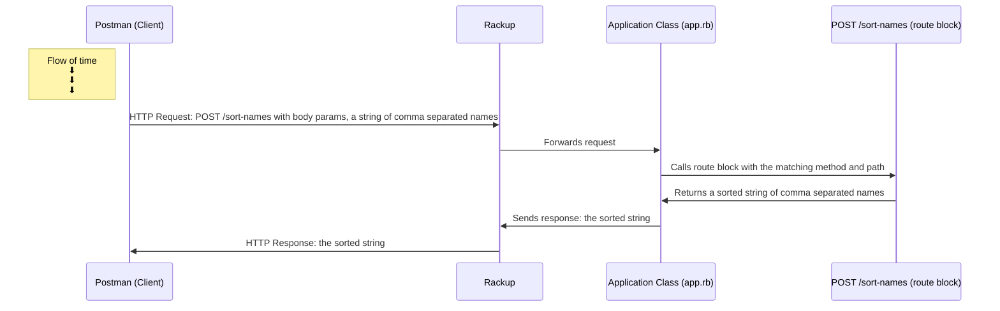

```mermaid
sequenceDiagram
    participant cl as Postman (Client)
    participant rack as Rackup
    participant app as Application Class (app.rb)
    participant post as POST /sort-names (route block)
 

    Note left of cl: Flow of time <br />⬇ <br /> ⬇ <br /> ⬇ 

    cl->>rack: HTTP Request: POST /sort-names with body params, a string of comma separated names
    rack->>app: Forwards request
    app->>post: Calls route block with the matching method and path
    post->>app: Returns a sorted string of comma separated names
    app->>rack: Sends response: the sorted string
    rack->>cl: HTTP Response: the sorted string 
```

